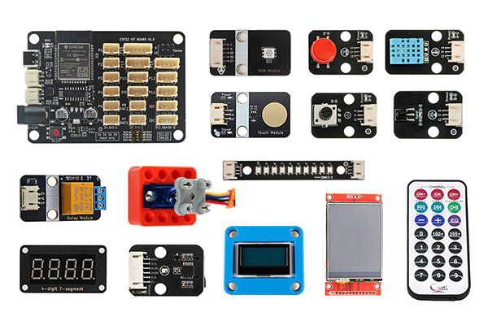

# ESP32 Cpp-Lesson
ESP32 C++ 教程，基于ESP32-Arduino-Framework应用开发框架。

[ESP32学习套件](https://www.xpstem.com/product/esp32-study-suit)



### Unit0 介绍
* 课程介绍

### Unit1 基础知识
* [1-1 开发环境](https://www.xpstem.com/article/2000476)
* [1-2 C++ 基础知识](https://www.xpstem.com/article/2000477)
* [1-3 ESP32 Arduino开发框架](https://www.xpstem.com/article/2000493)
```
  知识点：Application类、Board类
```  
### Unit2 LED
* [2-1 RGB三色LED](https://www.xpstem.com/article/2000495)
```  
  知识点：LED类及派生类、构造函数、多态应用
```
* [2-2 WS2812灯珠（Adafruit_NeoPixel库）](https://www.xpstem.com/article/2000496)
```
  知识点：类型强制转换
```
### Unit3 输入
* [3-1 按键输入](https://www.xpstem.com/article/2000499)
```
  知识点：按键信号转换、Button类及派生类、OneButton库封装、Button交互推荐流程
```
* [3-2 触摸感应输入](https://www.xpstem.com/article/2000500)
```
  知识点：触摸引脚、中断处理
```
### Unit4 传感器
* [4-1 数字量传感器](https://www.xpstem.com/article/2000502)
```
  知识点：Sensor类及派生类、数字量传感器使用、传感器的推荐交互流程
```
* [4-2 模拟量传感器](https://www.xpstem.com/article/2000503)
```
  知识点：模拟量传感器使用，旋转电位器、DHT11温湿度传感器，自定义传感器类
```
* [4-3 红外接收和遥控](https://www.xpstem.com/article/2000504)
```
  知识点：红外信号、IRremote库
```

### Unit5 执行器件
* [5-1 继电器](https://www.xpstem.com/article/2000505)
```
  知识点：Actuator类及派生类、继电器
```
* [5-2 舵机控制](https://www.xpstem.com/article/2000506)
```
  知识点：舵机驱动类、ESP32Servo库
```

### Unit6 定时器和多线程
* [6-1 定时器](https://www.xpstem.com/article/2000509)
```
  知识点：Timer类、FreeRTOS定时器、硬件定时器
```
* 6-2 多任务
* 6-3 任务间通信
* 6-4 共享资源访问

### Unit7 显示器件
* 7-1 7段式显示屏
```
  知识点：TM1650库
```
* 7-2 OLED显示屏
```
  知识点：Display类及派生类、U8G2库
```
* 7-3 TFT-LCD显示屏
```
  知识点：TFT_eSPI库
```

### Unit8 网络
* 8-1 WiFi连接
* 8-2 Web服务
```
  知识点：WebServer库
```
* 8-3 在网页上控制设备

### Unit9 存储
* 9-1 Flash存储
* 9-2 SD卡存储

-------
[开发框架说明](FRAMEWORK.md)
-------
【&#x1f44d;赞赏&#x1f44d;】

