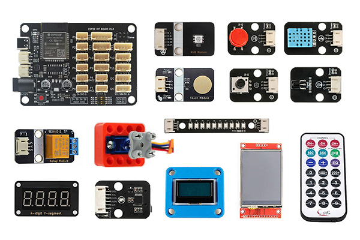

# ESP32 Cpp-Lesson
ESP32 C++ 教程，基于ESP32-Arduino-Framework应用开发框架。

[ESP32学习套件](https://www.xpstem.com/product/esp32-study-suit)



## 知识点
|                 |  Unit1  |  Unit2  |  Unit3  |  Unit4  |  Unit5  |  Unit6  |  Unit7  |  Unit8  |  Unit9  |  Unit10 |
|:---------------|:-------:|:-------:|:-------:|:-------:|:-------:|:-------:|:-------:|:-------:|:-------:|:-------:|
|  LED模块       |         |    Y    |         |    Y    |         |    Y    |         |    Y     |         |         |
|  按键模块       |         |         |    Y    |         |         |         |         |         |         |         |
|  中断          |         |         |   Y     |         |         |         |         |         |         |         |
|  触摸传感器    |         |         |         |     Y   |         |         |         |         |         |         |
|  旋转电位器      |         |         |       |    Y    |         |         |         |         |         |         |
|  温湿度传感器    |         |         |       |    Y    |         |         |    Y    |         |         |         |
|  红外摇控与接收    |         |        |       |   Y     |         |         |         |         |         |         |
|  继电器         |         |        |       |         |    Y    |         |         |         |         |         |
|  SG90舵机          |         |        |       |        |    Y    |         |         |         |         |         |
|  定时器         |         |        |       |        |         |    Y    |         |         |         |         |
|  多任务         |         |        |       |        |         |    Y    |         |         |         |    Y    |
|  消息队列与同步    |         |        |       |        |         |    Y    |         |         |         |         |
|  互斥访问         |         |        |       |        |         |    Y    |         |         |         |         |
|  数码管          |         |        |       |        |         |         |    Y    |         |         |         |
|  OLED显示屏        |         |        |       |        |         |         |    Y    |         |         |         |
|  TFT-LCD显示屏     |         |        |       |        |         |         |    Y    |   Y     |    Y    |    Y    |
|  互斥访问         |         |        |       |        |         |         |    Y    |         |         |         |
|  WiFi             |         |        |       |        |         |         |         |    Y    |    Y    |    Y    |
|  WEB服务          |         |        |       |        |         |         |         |    Y     |    Y     |         |  
|  HTTP请求        |         |        |       |        |         |         |         |    Y     |          |    Y     |  
|  SD和存储         |         |        |       |        |         |         |         |          |    Y     |    Y     |
|  音频             |         |        |       |        |         |         |         |         |           |   Y    |

## 教程
### Unit0 介绍
* 课程介绍

### Unit1 基础知识
* [1-1 开发环境](https://www.xpstem.com/article/2000476)
* [1-2 C++ 基础知识](https://www.xpstem.com/article/2000477)
* [1-3 ESP32 Arduino开发框架](https://www.xpstem.com/article/2000493)
```
  知识点：Application类、Board类
```  
### Unit2 LED
* [2-1 RGB三色LED](https://www.xpstem.com/article/2000495)
```  
  知识点：LED类及派生类、构造函数、多态应用
```
* [2-2 WS2812灯珠（Adafruit_NeoPixel库）](https://www.xpstem.com/article/2000496)
```
  知识点：类型强制转换
```
### Unit3 输入
* [3-1 按键输入](https://www.xpstem.com/article/2000499)
```
  知识点：按键信号转换、Button类及派生类、OneButton库封装、Button交互推荐流程
```
* [3-2 触摸感应输入](https://www.xpstem.com/article/2000500)
```
  知识点：触摸引脚、中断处理
```
### Unit4 传感器
* [4-1 数字量传感器](https://www.xpstem.com/article/2000502)
```
  知识点：Sensor类及派生类、数字量传感器使用、传感器的推荐交互流程
```
* [4-2 模拟量传感器](https://www.xpstem.com/article/2000503)
```
  知识点：模拟量传感器使用，旋转电位器、DHT11温湿度传感器，自定义传感器类
```
* [4-3 红外接收和遥控](https://www.xpstem.com/article/2000504)
```
  知识点：红外信号、IRremote库
```

### Unit5 执行器件
* [5-1 继电器](https://www.xpstem.com/article/2000505)
```
  知识点：Actuator类及派生类、继电器
```
* [5-2 舵机控制](https://www.xpstem.com/article/2000506)
```
  知识点：舵机驱动类、ESP32Servo库
```

### Unit6 定时器和多线程
* [6-1 定时器](https://www.xpstem.com/article/2000509)
```
  知识点：Timer类、FreeRTOS定时器、硬件定时器
```
* [6-2 多任务](https://www.xpstem.com/article/2000510)
```
  知识点：Task类、FreeRTOS多任务
```
* [6-3 任务间通信](https://www.xpstem.com/article/2000511)
```
  知识点：FreeRTOS消息队列、事件组和二进制信号量
```
* [6-4 资源互斥访问](https://www.xpstem.com/article/2000514)
```
  知识点：Mutex类、FreeRTOS互斥信号量、
```
### Unit7 显示器件
* [7-1 四位7段式数码管](https://www.xpstem.com/article/2000515)
```
  知识点：TM1650库
```
* [7-2 OLED显示屏](https://www.xpstem.com/article/2000516)
```
  知识点：Display类及派生类、U8G2库、I2C协议
```
* [7-3 TFT-LCD显示屏](https://www.xpstem.com/article/2000526)
```
  知识点：Window类及派生类、TFT_eSPI库、SPI协议
```

### Unit8 网络
* [8-1 WiFi连接和HTTP请求](https://www.xpstem.com/article/2000528)
```
  知识点：WiFi连接、HttpClient库、JSON处理
```
* [8-2 Wifi热点和网页上控制设备](https://www.xpstem.com/article/2000529)
```
  知识点：WiFi热点、WebServer库、网页上控制设备
```

### Unit9 存储
* [9-1 文件系统](https://www.xpstem.com/article/2000532)
```
  知识点：FileSystem类、Flash存储、SD卡、SPI协议
```
* [9-2 文件系统应用](https://www.xpstem.com/article/2000533)
```
  知识点：Web服务与文件系统
```

### Unit10 音频
* 10-1 音频播放
```
  知识点：音频处理、I2S协议、DAC数模转换、音频解码
```

* 10-2 音频录制
```
  知识点：ADC模数转换、音频编码
```

-------
[开发框架说明](FRAMEWORK.md)
-------
【&#x1f44d;赞赏&#x1f44d;】

